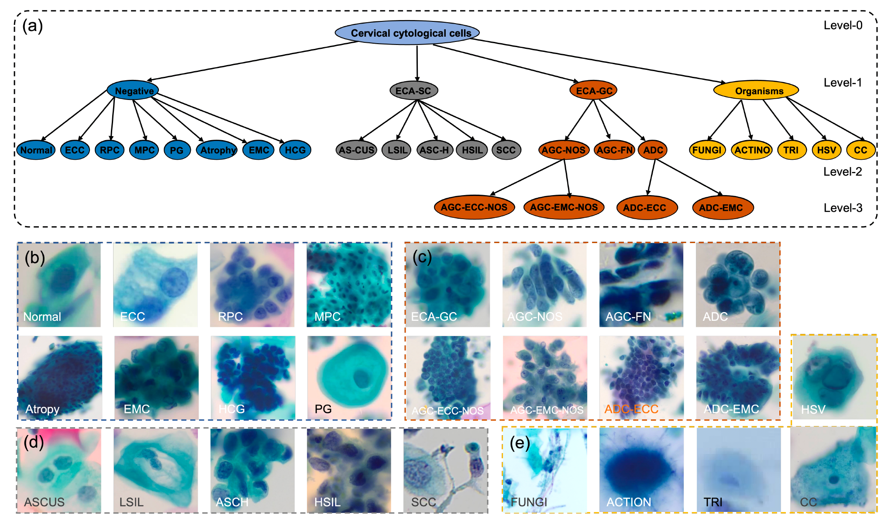

# HiCervix (This paper is under review)
####

This repo contains the original source code of the paper _HiCervix: An Extensive Hierarchical Dataset and Benchmark for Cervical Cytology Classification_.

In this paper, we release the largest three-level hierarchical cervical dataset (HiCervix), and propose a hierarchical vision transformer-based classification benchmark method (HierSwin).

### HiCervix Dataset:

HiCervix includes 40,229 cervical cells and is categorized into 29 annotated classes.   These classes are organized within a three-level hierarchical tree
to capture fine-grained subtype information. 



### HierSwin(benchmark method):
HierSwin is a hierarchical vision transformer-based classification network, where Swin transformer is first adopted for fine-grained feature extraction and a hierarchical classification head is integrated into the backbone network to merge the
information of fine-grained features.
<!-- The benchmark method of HierSwin and all the other methods implemented in this manuscript are organized in this repository. --> 
#### Installation

The implementation of HierSwin is based on the repo [making-better-mistakes](https://github.com/fiveai/making-better-mistakes), where we rewrote the dataset loader as follow for HiCervix and [albumentations](https://albumentations.ai/) is utilized for image augmentations.
```
import random
import cv2
import numpy as np
import pandas as pd
from PIL import Image
from torch.utils.data import Dataset

class InputDataset(Dataset):
    def __init__(self, data_csv_file, train=True, transform=None,
            target_transform=None, albu_transform=None):
        """data_csv_file: csv_file, [image_path, class_id]
            train: bool
            transform: image transform
            albu_transform: albumentations lib support
        """
        self.train = train
        self.transform = transform
        self.target_transform = target_transform
        self.albu_transform = albu_transform

        # load data
        df = pd.read_csv(data_csv_file)
        self.data = []
        for n in range(len(df)):
            row = df.iloc[n]
            image_path = row["image_path"]
            class_id = int(row["class_id"])
            self.data.append((image_path, class_id,))
        if self.train:
            random.shuffle(self.data)

    def __getitem__(self, index):
        img_path, target = self.data[index]
        img = cv2.imread(img_path, cv2.IMREAD_COLOR)
        img = cv2.cvtColor(img, cv2.COLOR_BGR2RGB)

        if self.albu_transform is not None:
           img = self.albu_transform(image=img)["image"]
        img = Image.fromarray(img)
        # transform
        if self.transform is not None:
            img = self.transform(img)
        return img, target

    def __len__(self):
        return len(self.data)
```


#### Dataset preparation
HiCervix can be downloaded from [Zenodo](https://zenodo.org/records/11081816). The dataset is splitted into three parts: train, validation, and test, each associated with one CSV file.
```
.
├── test
├── test.csv
├── train
├── train.csv
├── val
└── val.csv
```

The ```{train,val,test}.csv``` labels the hierarchical names for HiCervix dataset as follow:
|image_name                              |class_name |class_id|level_1|level_2|level_3    |
|----------------------------------------|-----------|--------|-------|-------|-----------|
|xxx.jpg|AGC-EMC-NOS|18      |AGC    |AGC-NOS|AGC-EMC-NOS|

The full names for the acronyms in the CSV files can be referenced in the ```dataset/hierarchy_classification/version2023
/hierarchy_names.csv```
<!--If you want to request data, please send me [data use agreement](https://docs.google.com/document/d/1B0fRRf8H40zG7l4gMnEUmr9PJaz5Z8HR/edit?usp=sharing&ouid=104345779948250629209&rtpof=true&sd=true) to this email (ys810137152@gmail.com) and we will send you the data link in 1-3 business days.-->

The hierarchical tree structure and lowest-common-tree distances files were generated beforehand and placed in the ```HierSwin/data``` as follow:

```
.
├── level_names_dict.pkl
├── tct_distances.pkl
└── tct_tree.pkl
```
For more details on the preprocessing of the Hierarchical structure of HiCervix, please see the ``` HiCervix_pre-processing.ipynb```
#### Training and evaluation
The CSV above files are used to specify the input for the training, evaluation, and test dataset (```dataset.py```), and you should first add ```image_path```  in the CSV files such as ```your_data_dir/xxx.jpg```.
* Training of HierSwin, 
```
cd HierSwin
python3 scripts/start_training.py --arch swinT 
        --loss hierarchical-cross-entropy 
        --alpha 0.4 
        --output hierswin_alpha0.4 
        --train-csv train_hierswin.csv
        --val-csv val_hierswin.csv 
        --epochs 50
```

* Evaluation of HierSwin, and the pre-trained HierSwin models can be [downloaded](https://drive.google.com/file/d/1TsULQjIsLHsKnO6DOin7MNXQy5Ycw3M9/view?usp=drive_link) 
```
cd HierSwin
python3 scripts/start_testing.py 
        --experiments_json hierswin_alpha0.4/opts.json 
        --checkpoint_path hierswin_alpha0.4/model_snapshots/checkpoint.epoch0030.pth.tar 
        --test-csv test_hierswin.csv
```
* The HierSwin and other methods usually will ouput the probabilities for finest level's hierarchy, the postprocess of the original evaluation results for HierSwin and other methods can be referenced in ```HiCervix_evaluation.ipynb```. For HierSwin, run the following script
```
cd HierSwin
python3 scripts/metrics_eval.py --res-csv hierswin_alpha0.4/HierSwin_res.csv
```
and you should get the following results:
```Level_1 accuracy: 0.9208
level_1 hierarchical distanse: 0.0549
##############################
Level_2 accuracy: 0.7836
level_2 hierarchical distande: 0.1821
##############################
Level_3 accuracy: 0.7835
level_3 hierarchical distande: 0.2082
##############################
Average accuracy: 0.8293
Average hierarchical distance: 0.1484
```


## License

HiCervix and HierSwin are released under the GPLv3 License and is available for non-commercial academic purposes.

### Citation
Please use below to cite this paper if you find our work useful in your research.
